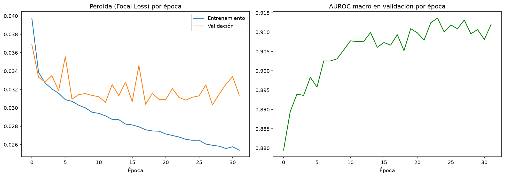
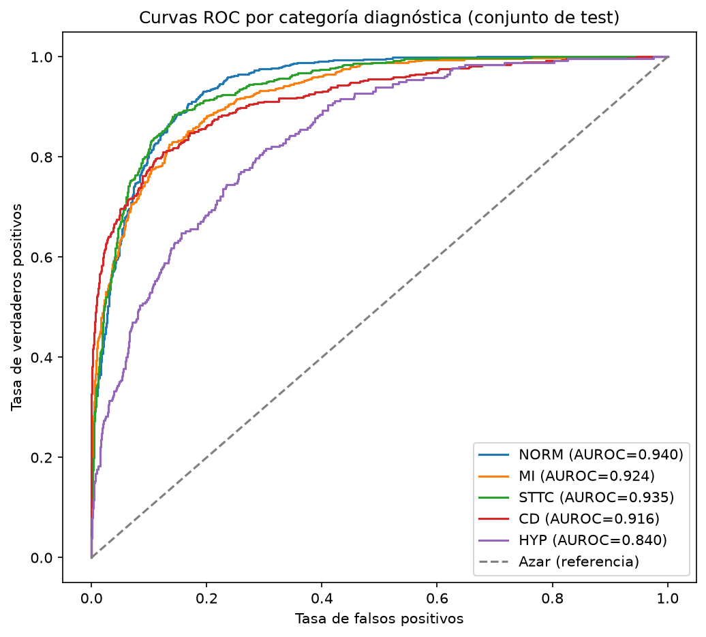
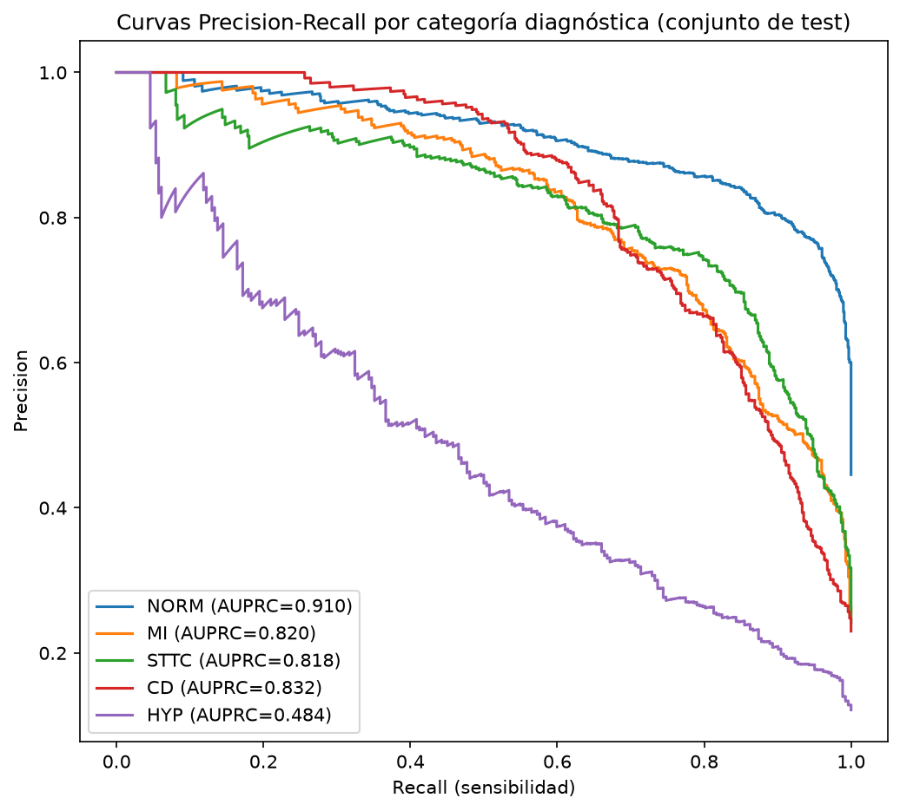

# Detección de Enfermedad Cardíaca Estructural mediante ECG

Proyecto de deep learning para predecir anomalías cardíacas estructurales
usando únicamente señales de electrocardiograma (ECG) de 12 derivaciones,
sin necesidad de un ecocardiograma.

## Estado del proyecto: Entrenamiento y evaluación completados (Fase 3/4)

## Motivación

El diagnóstico de enfermedades cardíacas estructurales normalmente requiere
un ecocardiograma: una prueba costosa y que depende de la disponibilidad de
un especialista. Este proyecto explora si un ECG estándar, mucho más
barato, rápido y accesible, contiene suficiente información para que un
modelo de deep learning prediga estas anomalías, actuando como una primera
herramienta de cribado.

## Dataset

Se utiliza [PTB-XL](https://physionet.org/content/ptb-xl/), un dataset
público con 21.799 registros de ECG de 12 derivaciones, pertenecientes a
18.869 pacientes distintos.

## Hallazgos de la exploración inicial (EDA)

Antes de tocar cualquier modelo, se hizo un análisis exploratorio para
entender bien la naturaleza de los datos. Estos son los hallazgos más
relevantes y cómo afectaron a las decisiones técnicas del proyecto.

### 1. Es un problema multi-etiqueta, no de una sola clase

Un mismo ECG puede tener varios diagnósticos a la vez: un paciente puede
presentar simultáneamente, por ejemplo, una arritmia y un problema de
conducción. En este dataset cada ECG tiene en promedio 1,27 diagnósticos,
con registros de hasta 4 diagnósticos simultáneos. El modelo no se diseñó
como "elige una opción entre varias" (multi-clase), sino como "decide, para
cada posible enfermedad, si está presente o no" (multi-etiqueta). Esto
condicionó directamente la función de pérdida usada en el entrenamiento.

### 2. Se excluyen los registros sin diagnóstico claro

411 registros (≈1,9%) no encajan en ninguna de las 5 categorías
diagnósticas principales del dataset. Al ser un porcentaje pequeño y no
aportar una etiqueta útil para el aprendizaje, se descartaron del conjunto
de entrenamiento.

### 3. El dataset está desbalanceado entre categorías

| Categoría                      | Registros | Porcentaje |
|--------------------------------|-----------|------------|
| NORM (normal)                  | 9.514     | 43,6%      |
| MI (infarto de miocardio)      | 5.469     | 25,1%      |
| STTC (cambios ST/T)            | 5.235     | 24,0%      |
| CD (trastornos de conducción)  | 4.898     | 22,5%      |
| HYP (hipertrofia)              | 2.649     | 12,2%      |

*(Los porcentajes suman más de 100% porque, como se explicó arriba, un
mismo ECG puede pertenecer a varias categorías.)* HYP es claramente
minoritaria frente a NORM, algo que se tuvo en cuenta en el entrenamiento
mediante Focal Loss, para evitar que el modelo terminara ignorando esa
clase.

### 4. Evitar fuga de datos entre pacientes

Aunque hay 21.799 ECGs, solo corresponden a 18.869 pacientes únicos: 2.930
pacientes tienen más de un ECG registrado. Dividir los datos de forma
aleatoria por ECG habría sido un error grave, porque el mismo paciente
podría acabar apareciendo tanto en entrenamiento como en test, y el modelo
podría memorizar la "firma" particular de ese paciente en vez de aprender
patrones generales de la enfermedad. Para evitarlo se usa la columna
oficial `strat_fold`, incluida por los creadores del dataset, que garantiza
una división sin solapamiento de pacientes entre grupos:

- Folds 1-8 → entrenamiento
- Fold 9 → validación
- Fold 10 → test

Este split es además el estándar en la literatura sobre PTB-XL, lo que
permite comparar los resultados de este proyecto con benchmarks publicados.

### 5. Variables descartadas por exceso de datos faltantes

`height` (altura) y `weight` (peso) tienen un 67,9% y 56,7% de valores
faltantes respectivamente. Es una proporción demasiado alta para imputar
con fiabilidad, así que se descartaron como variables de entrada.

### 6. Anonimización de edad

Las edades de pacientes de 90 años o más aparecen codificadas como el valor
300. Tras revisar la documentación oficial de PTB-XL, se confirmó que es
intencional: una técnica de anonimización para cumplir con el estándar
HIPAA, ya que las edades muy avanzadas son estadísticamente más fáciles de
usar para identificar a una persona real. Estos valores se tratan como una
categoría especial ("90 años o más"), no como una edad numérica real.

### 7. Marcapasos: exclusión en esta primera versión

285 registros corresponden a pacientes con marcapasos, que altera de forma
significativa la morfología de la señal ECG. Para evitar que el modelo
aprendiera a detectar el marcapasos en lugar de la patología real, estos
registros se excluyeron del entrenamiento. Queda como línea de trabajo
futuro entrenar un modelo específico para esta población.

### 8. Ruido técnico de la señal

El dataset incluye anotaciones de ruido eléctrico (`static_noise`,
`burst_noise`) y problemas de electrodos, registradas como texto libre en
alemán, indicando qué derivaciones se vieron afectadas. Dada su baja
frecuencia y su formato poco estructurado, se optó por una variable binaria
simple (`tiene_ruido_o_problema`), pensada para analizar en el futuro si el
rendimiento del modelo empeora en esos casos, sin tener que interpretar
cada código individualmente.

### 9. Distribución por sexo

Bien balanceada: 52,1% (sexo 0) frente a 47,9% (sexo 1). No hizo falta
ningún ajuste adicional aquí.

## Preprocesamiento de la señal

Cada ECG pasa por dos transformaciones antes de entrar al modelo:

1. **Filtrado paso-banda (0.5-40 Hz)**, para eliminar la deriva de línea
   base (causada por la respiración, en frecuencias muy bajas) y el ruido
   de alta frecuencia (interferencias eléctricas). Se validó con una señal
   sintética de control antes de aplicarlo al dataset real. Sobre las
   señales de PTB-XL el filtro elimina en promedio un ~15% de la "energía"
   de la señal: un efecto sutil pero real, coherente con el uso de equipos
   de grabación clínicos de buena calidad.
2. **Normalización Z-score por derivación**: cada una de las 12
   derivaciones se normaliza de forma independiente a media 0 y desviación
   estándar 1, para que ninguna derivación domine el aprendizaje solo por
   tener una amplitud naturalmente mayor.

Los datos procesados se dividen en train/val/test usando el `strat_fold`
oficial de PTB-XL, y se guardan en formato `.npy` para una carga eficiente
durante el entrenamiento.

## Arquitectura del modelo

Red neuronal convolucional 1D (CNN 1D) en PyTorch, pensada para series
temporales biomédicas:

- 3 bloques convolucionales (32 → 64 → 128 canales), cada uno con Batch
  Normalization, activación ReLU y MaxPooling, para detectar patrones
  morfológicos a distintas escalas temporales.
- Un clasificador final con Dropout (0.3), para reducir el riesgo de
  sobreajuste.
- Salida de 5 valores, uno por categoría diagnóstica (NORM, MI, STTC, CD,
  HYP), tratando el problema como clasificación multi-etiqueta.

Antes de entrenar nada, se verificó con un smoke test que todo el pipeline
funcionaba de principio a fin (carga de datos → Dataset → DataLoader →
modelo) con un batch de ejemplo.

## Entrenamiento

Se entrenó `ECG_CNN1D` con **Focal Loss** (α=0.25, γ=2.0) en lugar de una
función de pérdida estándar, para compensar el desbalanceo de clases
descrito arriba. Esta función reduce el peso de aprendizaje de los ejemplos
que el modelo ya clasifica bien, y obliga a prestar más atención relativa a
los casos difíciles o minoritarios como HYP.

El optimizador fue Adam (tasa de aprendizaje 1e-3), guardando el modelo en
cada época solo si mejoraba el AUROC macro en el conjunto de
**validación** — nunca en entrenamiento, para no sesgar la decisión.



### ¿Merece la pena entrenar más épocas?

Se probó extender el entrenamiento a 40 épocas (el doble de lo
inicialmente planeado) para ver si el modelo seguía mejorando. A partir de
cierto punto intermedio, la pérdida de validación empezó a subir de forma
sostenida mientras la de entrenamiento seguía bajando: la señal clásica de
sobreajuste, con el modelo memorizando detalles del set de entrenamiento en
vez de generalizar. El mejor modelo (según AUROC de validación) se dio en
la época 29, con un AUROC de validación de 0,9114. Evaluado después en el
conjunto de test, ese mismo modelo obtuvo un AUROC macro de 0,906 (ver
tabla más abajo) — la diferencia entre ambos números es normal: uno mide el
rendimiento en el conjunto usado para elegir el modelo, el otro en datos
completamente nuevos.

Gracias a guardar solo el mejor modelo según AUROC de validación, el
modelo final no se ve afectado por el sobreajuste de las épocas
posteriores.

## Resultados en el conjunto de test

Evaluación final sobre el conjunto de test (fold 10), datos que el modelo
no vio en ningún momento durante el entrenamiento ni la validación:

| Clase | AUROC | AUPRC | Prevalencia en el dataset  |
|-------|-------|-------|----------------------------|
| NORM  | 0.936 | 0.910 | 43,6%                      |
| MI    | 0.917 | 0.820 | 25,1%                      |
| STTC  | 0.931 | 0.818 | 24,0%                      |
| CD    | 0.912 | 0.832 | 22,5%                      |
| HYP   | 0.832 | 0.484 | 12,2%                      |

**AUROC macro: 0,906** · **AUPRC macro: 0,773**




### Cómo interpretar estos resultados

AUROC mide qué tan bien distingue el modelo entre un ECG con la patología y
uno sin ella. Un valor de 0,906 significa que, en aproximadamente 9 de cada
10 comparaciones, el modelo puntúa más alto al ECG que realmente tiene la
anomalía.

AUPRC es más exigente en datasets desbalanceados: mide cuánto acierta el
modelo entre todo lo que marca como positivo, y cuántos casos reales
consigue detectar. Por eso se reporta junto al AUROC.

HYP es, con diferencia, la clase más difícil para el modelo (AUROC 0,832,
AUPRC 0,484), algo esperable al ser la clase minoritaria del dataset. Aun
así, su AUPRC es casi 4 veces superior al que se obtendría adivinando al
azar (≈0,122, su prevalencia), señal de que el modelo sí aprendió algo real
sobre esta clase, aunque con menos confianza que en el resto.

### Sobre el alcance de estos resultados

Los diagnósticos de PTB-XL (NORM, MI, STTC, CD, HYP) son hallazgos que un
cardiólogo puede identificar leyendo directamente el ECG; de hecho, así se
etiquetó originalmente el dataset. Este proyecto demuestra que un modelo
puede automatizar esa lectura con buena fiabilidad, pero es un reto
distinto —y más accesible— al de detectar patología estructural que no es
evidente en una lectura convencional del ECG (el objetivo, por ejemplo, del
dataset EchoNext, que queda como posible extensión futura de este
proyecto).

## Problemas encontrados y soluciones

Documento aquí los problemas técnicos reales que fui encontrando, porque
forman parte del proceso de aprendizaje y pueden ahorrarle tiempo a
cualquiera que reproduzca este proyecto en Windows.

**1. Aviso falso de "módulo no encontrado" en el editor.** El editor
marcaba `wfdb` como no encontrado en los archivos `.py`, aunque el
notebook sí lo reconocía sin problema. VS Code usa dos configuraciones de
Python distintas: el "kernel" para los notebooks, y el "intérprete del
editor" para los `.py` sueltos. Bastó con fijar manualmente el intérprete
del editor al entorno `venv` del proyecto (`Python: Select Interpreter`)
para que ambas configuraciones coincidieran.

**2. El filtro de la señal parecía no hacer nada.** Al comparar
visualmente la señal ECG antes y después del filtrado, las gráficas
salían casi idénticas. Para descartar un bug, se validó el filtro con una
señal sintética generada a propósito con ruido conocido, y se midió
numéricamente la diferencia entre la señal cruda y la filtrada: un ~15% de
la energía de la señal se elimina en promedio. El filtro funcionaba bien;
el efecto era simplemente sutil porque las señales de PTB-XL ya vienen
relativamente limpias, al proceder de equipos clínicos.

**3. `FileNotFoundError` al guardar los datos procesados.** Tras procesar
los más de 21.000 ECGs (un proceso de varios minutos), el guardado final
falló porque la carpeta de destino tenía un error tipográfico
(`proccesed` en vez de `processed`). Se corrigió el nombre y se repitió el
procesamiento.

**4. `OSError: WinError 1114` al importar PyTorch.** Windows no conseguía
cargar uno de los archivos internos de PyTorch (`c10.dll`). Se descartaron
la falta del Visual C++ Redistributable y un posible conflicto con la
sincronización de OneDrive, verificando ambos explícitamente. La solución
fue reinstalar PyTorch fijando una versión concreta y estable
(`torch==2.4.1`) en vez de la última disponible, que sí presentaba el
conflicto.

**5. `ModuleNotFoundError: No module named 'src'` tras reiniciar el
kernel.** Después de reiniciar el kernel para resolver el problema
anterior, las importaciones desde `src/` dejaron de funcionar.
`sys.path.append('..')`, que añade la carpeta raíz del proyecto a las
rutas de búsqueda de Python, solo persiste mientras el kernel está activo:
hay que volver a ejecutarlo tras cada reinicio.

**6. Resultados distintos al reentrenar sin cambiar el código.** Tras un
reinicio de kernel, el entrenamiento dio métricas ligeramente distintas a
la ejecución anterior, pese a no tocar nada del código. El motivo: no
había una semilla aleatoria fija, así que tanto la inicialización de pesos
del modelo como el orden de mezclado de los datos (`shuffle=True`)
variaban en cada ejecución. Se añadió `fijar_semilla()` en `src/utils.py`,
que fija las semillas de Python, NumPy y PyTorch. Con la semilla fijada
(valor 42), el entrenamiento converge de forma determinista al resultado
reportado en este README (AUROC de validación 0,9114 en la época 29). La
consistencia entre las distintas ejecuciones, con o sin semilla, sirvió
además para confirmar que el rendimiento del modelo es robusto y no
producto de una inicialización afortunada.

## Estructura del repositorio

```
├── assets/                       # Gráficas generadas para este README
│   ├── curvas_entrenamiento.png
│   ├── curvas_roc.png
│   └── curvas_precision_recall.png
├── data/                         # Dataset (excluido de git, ver .gitignore)
├── models/                       # Modelo entrenado y resultados
│   ├── mejor_modelo.pt
│   └── resultados_test.csv
├── notebooks/
│   ├── 01_exploracion_datos.ipynb
│   ├── 02_preprocesamiento.ipynb
│   └── 03_entrenamiento.ipynb
├── src/
│   ├── __init__.py
│   ├── data_utils.py             # Limpieza de metadatos
│   ├── preprocessing.py          # Filtrado y normalización de la señal
│   ├── dataset.py                # Dataset de PyTorch
│   ├── model.py                  # Arquitectura CNN 1D
│   ├── losses.py                 # Focal Loss multi-etiqueta
│   ├── train.py                  # Bucle de entrenamiento y evaluación
│   └── utils.py                  # Semilla aleatoria (reproducibilidad)
├── requirements.txt
└── README.md
```

## Cómo reproducir el entorno

```bash
git clone https://github.com/Marlopera9/ecg-structural-heart-disease.git
cd ecg-structural-heart-disease
python -m venv venv
source venv/Scripts/activate  # Windows
pip install -r requirements.txt
```

El dataset debe descargarse manualmente desde
[PhysioNet](https://physionet.org/content/ptb-xl/) y colocarse en la
carpeta `data/`.

> En Windows se recomienda específicamente `torch==2.4.1` (versión CPU):
> versiones más recientes dieron errores de carga de DLL
> (`OSError: WinError 1114`) en pruebas locales. Ver el problema 4 más
> arriba.

## Próximos pasos

- [x] Exploración de metadatos y calidad de datos (EDA)
- [x] Preprocesamiento de señal: filtrado, normalización, exclusión de registros
- [x] Arquitectura CNN 1D en PyTorch
- [x] Entrenamiento con manejo de desbalanceo de clases (Focal Loss)
- [x] Evaluación con AUROC / AUPRC por categoría diagnóstica
- [ ] Explicabilidad con Grad-CAM 1D
- [ ] Despliegue como API con FastAPI

## Consideraciones éticas y de sesgos

Este proyecto tiene fines exclusivamente educativos y de demostración
técnica. No debe utilizarse como herramienta de diagnóstico real. Cualquier
modelo entrenado hereda las características demográficas y clínicas del
dataset PTB-XL (proveniente de un centro médico en Alemania), por lo que
su rendimiento podría no generalizar a poblaciones con características
demográficas distintas.